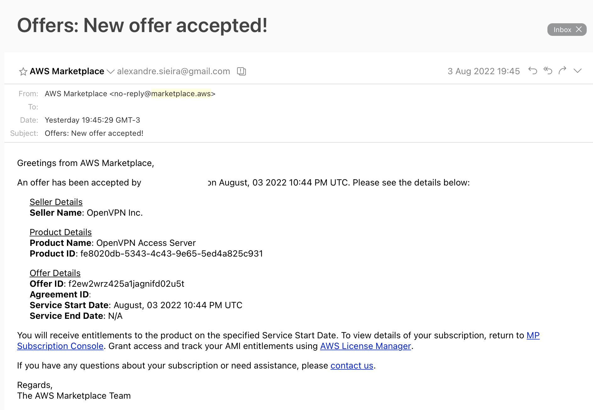

# AWS Marketplace Data

This repository was created to store information about the AWS Marketplace that is not otherwise easily available
using APIs. It was started as part of the research on the 2022 DEF CON Cloud Village talk 
["Shopping for Vulnerabilities"](https://cloud-village.org/#talks?collapseAlexandreSieira),
presented by [Alexandre Sieira](https://twitter.com/AlexandreSieira), also based on the work of Glaysson Tomaz and 
Marcelo Lima from Tenchi Security.

## Crowdsourced Mapping of Sellers and Product Codes

Currently the goal is to crowdsource mappings of [AMI product codes](https://docs.aws.amazon.com/marketplace/latest/userguide/ami-getting-started.html) 
(also referred to as offer IDs) to seller and product information. This can be used to enrich lookups into 
[EC2 instance identity documents](https://docs.aws.amazon.com/AWSEC2/latest/UserGuide/instance-identity-documents.html)
which will contain an array of product codes in the `marketplaceProductCodes` field. The goal is twofold:
* Allow blue teamers and cloud ops folks to more easily and quickly understand the role and provenance of running instances
if they were created through the AWS Marketplace;
* Give red teamers a non-noisy additional recon capability, since calling the instance metadata service in compromised
machines is much less likely to trigger alarms than looking at the filesystem or installed packages.

The simplest way to obtain this information as a buyer is to look for e-mails sent automatically by 
`noreply@marketplace.aws` with the subject `Offers: New offer accepted!`, as per this example:

The fields of interest here are `Seller Name`, `Product Name`, `Product ID` and `Offer ID`. None of these are specific 
to your account or organization, so they are safe to share here, *except when the offer ID starts with the string 
`offer-`, in which case it's a private offer that you should not share here*.

Sellers will have this information directly on the AWS Marketplace Management Portal, in case they want to proactively
submit their own IDs.

Feel free to submit PRs with additional data to the [contrib/product_codes.csv](contrib/product_codes.csv) file as required, or send 
submissions via Twitter DM to [@AlexandreSieira](https://twitter.com/AlexandreSieira) or via e-mail to 
`asieira (at) tenchisecurity.com`.

## Automated Mapping of AMI IDs and Product Codes

This repo runs a daily Github Action that calls the [EC2 DescribeImages](https://docs.aws.amazon.com/AWSEC2/latest/APIReference/API_DescribeImages.html)
operation and populates [data/amis.csv](data/amis.csv) listing AMIs used by AWS Marketplace AMI products. This includes the 
product codes and snapshot IDs of EBS volumes associated with each one.
